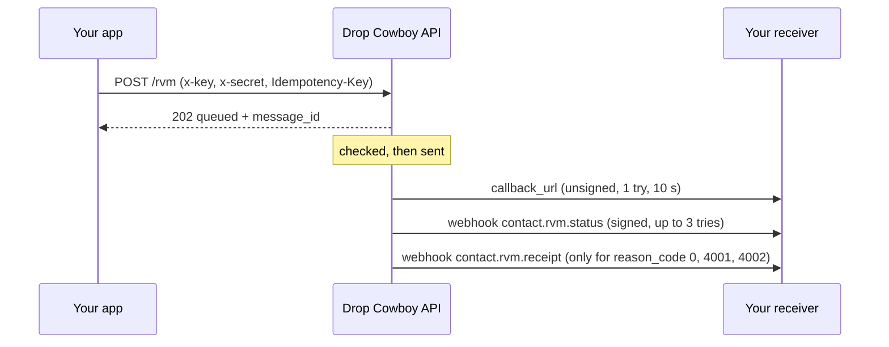

# Send results

A send happens in two steps. First Drop Cowboy takes your request. Later it
tells you what happened.



## Step 1: the 202

```json
{ "status": "queued", "message_id": "2b8f5d1a-7c3e-4a9b-9f6d-4e2a8c1b7d53" }
```

`202` means "got it, it's in line." Nothing has been checked yet. A wrong
secret, a bad phone number or a missing audio file still gets `202`, and fails
in step 2.

## Step 2: the result

Each send ends with a `status` (`success` or `failure`) and a numeric
`reason_code`. It arrives:

- on your `callback_url`, if the send had one,
- on your webhooks, if you created one for the event,
- and in **Settings > API Logs** in the dashboard.

`message_id` is not on the result. To match a result to your request, put your
own `foreign_id` on the send; the callback echoes it back. Status webhooks
don't carry `foreign_id`, so match those on `to` or `contact_id`.

Branch on `reason_code`, not on the `reason` text. The text can change; the
number can't. The ones you'll meet first:

| Code | Means | What to do |
|---:|---|---|
| `0` | Success. The voicemail was left in the mailbox. | Nothing. |
| `3000` | No funds. | Add funds, then resend. |
| `3001` | The audio isn't usable, often a `media_id` copied from the docs. | Upload your own file and use its `media_id`. |
| `3007` | Wrong key or secret. Arrives on `callback_url` only. | Fix the credentials. |
| `3014` | `audio_url` isn't enabled for this account. | Use `media_id` or text to speech. |
| `3021` | `tts_body` is over 1,200 characters. | Shorten it. |
| `3027` | The `Idempotency-Key` was used before with a different body. | Use a new key. |
| `3028` | The `Idempotency-Key` isn't valid. | Use a random UUID. |
| `3040` | Testing mode, and this isn't a test number. | Add it on Dialing rules. |
| `4001` | The contact has no voicemail set up. | Don't resend. |
| `4002` | The contact's voicemail is full. | Don't resend. |
| `4010` | No phone line to send from. | Pass `phone_line_id`, or set a default line. |
| `6011` | The account requires consent and none is on file. | Record the opt-in first. |

[Outcomes](https://www.dropcowboy.com/developers/api/outcomes) lists every code
and whether to retry.

## Proof of delivery

When the carrier's voicemail system answered, a `contact.rvm.receipt` webhook
follows with a link to a recording of the call. That covers `reason_code` `0`,
and also `4001` and `4002`, where the recording is the carrier saying the
mailbox isn't set up or is full.
The link lasts 7 days. See
[Proof of delivery](https://www.dropcowboy.com/developers/api/proof-of-delivery).

## Read more

- [Send lifecycle](https://www.dropcowboy.com/developers/api/send-lifecycle)
- [Webhooks](webhooks.md)
