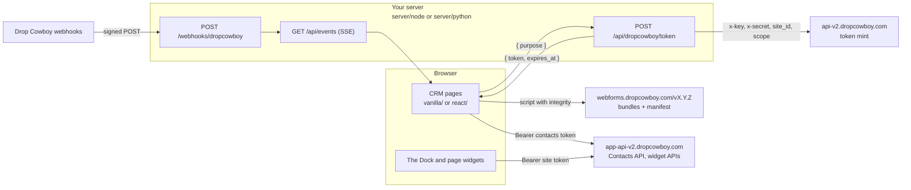

# Drop Cowboy sample CRM

A small contacts CRM built on Drop Cowboy Building Blocks. It is the reference
for building your own: copy it, run it, and replace the parts marked
`REPLACE WITH YOUR AUTH`.

It shows the three ways to build on Drop Cowboy, side by side:

- the **headless Contacts API**, called from the browser with a short-lived
  site token, for your own list, search and edit screens,
- **The Dock**, one script that adds calling, texting and an inbox to every
  page, and
- **page-level web components** such as `<dc-contact-card>` and
  `<dc-pipeline-board>`, for screens you would rather not build.

There are two front-ends with the same pages, `vanilla/` (no build step) and
`react/` (React 19), and two servers with the same routes, `server/node/` and
`server/python/`. Both front-ends share the modules in `shared/`, so they
differ only in rendering.

## Pages and the building blocks they use

| Page | Path | Building block | Token purpose |
|---|---|---|---|
| Contacts | `/contacts` | Contacts REST API: list, search, add | `contacts` |
| Contact | `/contacts/:id` | REST API for edit, delete and recording consent, `<dc-contact-card>` with its timeline, The Dock for Call and Text | `contacts`, `session` |
| Pipeline | `/pipeline` | `<dc-pipeline-board>`. Drag a card, or use its Move to stage menu, to change its stage. | `contacts` |
| Inbox | `/inbox` | `<dc-shared-inbox>`, which borrows The Dock's session | `session` |
| Campaigns | `/campaigns` | The campaign hub, read-only | `campaigns` |
| Phone | `/phone` | `<dc-phone-hub>` and `<dc-number-picker>`. Renting a number asks first. | `phone` |
| Setup | `/setup` | Readiness checklist, auth mode, business number | none |
| Every page | | The Dock | `session` |

The browser asks the server for a token by **purpose**. The server alone maps
a purpose to scopes, so a page can never ask for more than it needs:

| Purpose | Scopes | Needs a carrier and a balance |
|---|---|---|
| `session` | `["dialer:webrtc", "contacts"]` | Yes |
| `contacts` | `["contacts"]` | No |
| `campaigns` | `["campaigns"]` (read-only) | No |
| `phone` | `["phone:hub"]` (can rent numbers) | Yes |

Because the contacts pages use their own `contacts` token, they keep working
for a team that has not connected a carrier or added funds. The Dock shows
why calling is unavailable instead.

## Quick start

You need Node 22.12 or later. The Python server needs Python 3.9 or later.
You also need a Drop Cowboy account and an API key from the dashboard under
**Developers > API keys**, with the `numbers:write` scope (to mint) and
`balance:read` (for the setup checklist). Until "Sign in with Drop Cowboy"
ships, run the sample in **server** mode, which is the default.

Every mode starts the same way, from this folder:

```bash
cp .env.example .env
node -e "console.log(crypto.randomUUID())"   # your DROPCOWBOY_SITE_ID
```

`DROPCOWBOY_SITE_ID` is one UUID per deployed app. Generate it once and keep
it: it partitions the embed inbox, and Drop Cowboy rejects anything that is
not a UUID.

### Server mode (production pattern)

Your server mints tokens with your API key. Create the key in the Drop Cowboy
dashboard under **Developers > API keys**, with the `numbers:write` scope (to
mint) and `balance:read` (for the setup checklist).

In `.env`:

```bash
DC_AUTH_MODE=server
DROPCOWBOY_SITE_ID=<the UUID you generated>
DROPCOWBOY_API_KEY=<your API key>
DROPCOWBOY_API_SECRET=<your API secret>
SAMPLE_USER_ID=<a UUID for the signed-in user; .env.example already has one>
```

Then start a server and open <http://127.0.0.1:8080>:

```bash
cd server/node
npm install
npm start
```

Or the Python server:

```bash
cd server/python
python3 -m venv .venv
source .venv/bin/activate
pip install -r requirements.txt
python -m sample_crm
```

`SAMPLE_USER_ID` in `.env.example` stands in for your signed-in user until you
replace `requireUser()`. It becomes the `sub` of every token.

### MCP session mode (development with an AI agent)

Your AI agent mints a token with the Drop Cowboy MCP and writes it to a file.
The server hands that file to the browser, on this machine only. No API key
is involved.

In `.env`:

```bash
DC_AUTH_MODE=mcp-session
DROPCOWBOY_SITE_ID=<the UUID you generated>
```

Ask your agent to call `mint_embed_token` with that `site_id` and
`scope: ["dialer:webrtc", "contacts"]`, then write the result to
`.dropcowboy/session.json` in this folder:

```json
{ "token": "<token from mint_embed_token>", "expires_at": 1790000000000, "site_id": "5a4b3c2d-1e0f-4a9b-8c7d-6e5f4a3b2c1d" }
```

`expires_at` is epoch milliseconds, copied from the mint result. `.dropcowboy/`
is in `.gitignore`. Start a server as above and open
<http://127.0.0.1:8080>. When the token expires, ask the agent to mint again
and rewrite the file. The Campaigns and Phone pages need their own tokens, so
they are unavailable in this mode.

### Login mode (coming soon)

"Sign in with Drop Cowboy" lets you try the sample with your own Drop Cowboy
login and no API key. It needs a public sign-in client id for
`AUTH0_CLIENT_ID`, and that client has not been created. Until it is, the page
shows "Sign-in is not set up yet": keep `DC_AUTH_MODE=server` until the client
exists. `.env.example` already defaults to `server`.

### The React front-end

The servers serve `vanilla/` at `/`. To run the React version:

```bash
cd react
npm install
npm run dev      # http://localhost:5173/react/, proxies to the server on 127.0.0.1:8080
npm run build    # writes react/dist/, which the server serves at /react/
```

### Receive webhooks

The Activity panel fills from Drop Cowboy webhooks, posted to
`/webhooks/dropcowboy`. Drop Cowboy needs a public HTTPS URL to reach it, so
put the server behind a tunnel or deploy it first.

Create one webhook that carries every event the panel shows, with a key that
has `webhooks:write`. A webhook is one URL, a list of event types and its own
signing secret, addressed by its `webhook_id`. This creates it and writes the
secret to `.env` without printing it (it needs `jq`):

```bash
HOOK_URL=https://crm.example.com/webhooks/dropcowboy
SECRET=$(curl -sf -X POST https://api-v2.dropcowboy.com/register/public/webhooks \
  -H "x-key: $DROPCOWBOY_API_KEY" -H "x-secret: $DROPCOWBOY_API_SECRET" -H "Content-Type: application/json" \
  -d '{"hook_url":"'"$HOOK_URL"'","event_types":["contact.created","contact.updated","contact.deleted","contact.msg.received","contact.msg.sent","contact.msg.opt","contact.sms.status","contact.call.answered","contact.call.missed","contact.call.hangup","contact.voicemail.received","contact.rvm.status","contact.consent.granted","contact.consent.revoked","contact.pipeline.stage.entered"]}' \
  | jq -r '.data.signing_secret // empty')
if [ -z "$SECRET" ]; then
  echo "Creating the webhook failed"
else
  { grep -v '^DROPCOWBOY_WEBHOOK_SECRET=' .env; echo "DROPCOWBOY_WEBHOOK_SECRET=$SECRET"; } > .env.new && mv .env.new .env
fi
```

Restart the server afterwards. An account can hold up to 50 webhooks and
creating one never replaces another, so run this once: running it again adds a
second webhook, and every event arrives twice. List them with
`GET /register/public/webhooks`, delete one with
`DELETE /register/public/webhooks/{webhook_id}`, and issue a new secret for one
with `POST /register/public/webhooks/{webhook_id}/rotate-secret`. The server
accepts a delivery signed with any secret in `DROPCOWBOY_WEBHOOK_SECRET`
(comma-separated). A rotated secret takes over at once, retries included, so
add the new secret straight away; keeping the old one for a minute covers a
delivery already on its way. Calls placed from the sample carry `site_id` and
`external_user_id` (your user's id, the token's `sub`) on the
`contact.call.*` events.

## Architecture



- Your API key never leaves your server. The server mints site tokens at
  `POST https://api-v2.dropcowboy.com/phone/public/embed/token`.
- The browser holds only short-lived site tokens, in memory, and calls
  `https://app-api-v2.dropcowboy.com` with them.
- Widgets get their token as a JavaScript property (`init({ token, getToken })`
  or `el.tokenManager`), never as an HTML attribute or in a URL.
- Bundles load from a pinned CDN release with Subresource Integrity hashes
  read from that release's `building-blocks-manifest.json`.

## Configuration

Both servers read `.env` from this folder. Variables already set in your
shell win. [`server/CONTRACT.md`](server/CONTRACT.md) is the source of truth
for every variable, route and error code.

| Variable | Needed for | Notes |
|---|---|---|
| `DC_AUTH_MODE` | all | `server`, `mcp-session` or `login`. Default `server`. |
| `DROPCOWBOY_SITE_ID` | `server`, `login` | One stable UUID per deployed app. Checked in every mode when set. |
| `DROPCOWBOY_API_KEY`, `DROPCOWBOY_API_SECRET` | `server` | Scopes `numbers:write` and `balance:read`. Secret. |
| `SAMPLE_USER_ID` | `server` | A UUID standing in for your user until you replace `requireUser()`. |
| `DROPCOWBOY_WEBHOOK_SECRET` | webhooks | The signing secret of each webhook, comma-separated. Secret. |
| `DROPCOWBOY_API_BASE` | | Default `https://api-v2.dropcowboy.com`. |
| `AUTH0_DOMAIN`, `AUTH0_CLIENT_ID`, `AUTH0_AUDIENCE` | `login` | Public values, safe in a browser. |
| `DC_CDN_VERSION` | | Pins the widget release, such as `3.33.6`. Releases before 3.33.1 do not publish the manifest the loader reads. Empty uses the front-end default. `latest` is refused, because integrity hashes need a fixed release. |
| `HOST`, `PORT` | | Default `127.0.0.1` and `8080`. |

## Project layout

```text
sample-crm/
  .env.example         Every setting, with comments. Copy to .env.
  server/
    CONTRACT.md        The server contract every implementation follows.
    node/              Express server.
    python/            Flask server.
    conformance/       Language-neutral HTTP suite both servers pass.
  shared/              ES modules both front-ends use.
    crm.js             startCrm(): config, tokens, CDN loader, Contacts API, The Dock.
    token-provider.js  Token by purpose, reuse, refresh.
    contacts-api.js    The headless Contacts API client.
    dropcowboy-cdn.js  Loads bundles from the CDN with SRI.
    widgets.js         Hands tokens to widgets; Call, Text, inbox, hubs.
    errors.js          Every error code in plain language.
    events.js          Webhook events over Server-Sent Events.
    login.js, auth0-pkce.js   Login mode.
    setup.js           The readiness checklist.
  vanilla/             The CRM with no framework and no build step.
  react/               The same CRM in React 19.
  tests/e2e/           Playwright browser tests for both front-ends.
  LICENSE, NOTICE      MIT for this folder only. Read NOTICE.
```

Each folder has its own README with more detail:
[`server/node`](server/node/README.md), [`server/python`](server/python/README.md),
[`server/conformance`](server/conformance/README.md), [`shared`](shared/README.md),
[`vanilla`](vanilla/README.md) and [`react`](react/README.md).

## Running the tests

From this folder, one command runs everything. You do not need a Drop Cowboy
account: nothing here calls the live API.

```bash
npm test
```

`npm run test:fast` skips the browser tests. Each part also has its own suite:

| What | Command |
|---|---|
| Shared modules | `cd shared && npm test` |
| Node server | `cd server/node && npm install && npm test && npm run lint` |
| Python server | `cd server/python && pip install -r requirements-dev.txt && pytest && ruff check .` |
| Server contract, Node | `cd server/conformance && npm run test:node` |
| Server contract, Python | `cd server/conformance && npm run test:python` |
| React front-end | `cd react && npm install && npm test && npm run lint` |
| Browser tests, both front-ends | `cd tests/e2e && npm install && npm run browsers && npm test` |

None of them call Drop Cowboy. The conformance suite runs each server against
a local mock of the Drop Cowboy API, and the browser tests (Playwright) run
both front-ends against a fake Drop Cowboy and a fake CDN. `npm run test:vanilla`
and `npm run test:react` run one front-end. The browser tests start the Node
server unless you set `SERVER_CMD` and `SERVER_CWD`, as for the conformance
suite.

## Production checklist

The sample is safe to run on your own machine. Before real users touch it:

1. **Replace `requireUser()`.** In `server/node/src/auth.js` (and
   `require_user()` in the Python server) it returns `SAMPLE_USER_ID` for
   every request. Put your own authentication there, and pass your signed-in
   user's id as `sub`. It also guards `/api/events`.
2. **Serve over HTTPS.** Run the server behind TLS, keep `HOST` on loopback
   behind your proxy, and give Drop Cowboy a public HTTPS URL for webhooks.
3. **Keep secrets in a secret store.** Load the API key, API secret and
   webhook secrets from your platform's secret manager, not a `.env` file on
   disk. Never log them, or any site token.
4. **Make webhooks durable.** List the signing secret of every webhook in
   `DROPCOWBOY_WEBHOOK_SECRET`. Rotating a secret stops the old one at once, so add the new one right away. The sample keeps seen event
   ids in memory; store them durably and skip any `X-Event-Id` you have
   already processed. Answer `2xx` within 5 seconds and do the work from your
   own queue.
5. **Rate-limit the token route.** The sample does not. Limit
   `POST /api/dropcowboy/token` per user, and honor `Retry-After` on any `429`
   from Drop Cowboy.
6. **Pin the CDN and set a Content Security Policy.** Set `DC_CDN_VERSION` to
   the release you tested. For the strongest protection, copy that release's
   `integrity` values into your build instead of fetching the manifest at
   runtime. Start from this policy, in `Content-Security-Policy-Report-Only`
   first:

   ```text
   default-src 'self';
   script-src 'self' https://webforms.dropcowboy.com;
   connect-src 'self' https://app-api-v2.dropcowboy.com https://webforms.dropcowboy.com;
   ```

   Calling opens a secure WebSocket and uses the microphone, so add the
   `wss:` origin the browser reports and allow `microphone` in your
   `Permissions-Policy`, then enforce the policy.
7. **Keep the phone token on the phone page.** It can rent numbers. Leave
   `window.DropCowboy.confirmSpend = true` set before any bundle loads.

## Troubleshooting

Every code below is explained in the app itself by `explainError()` in
[`shared/errors.js`](shared/errors.js).

| You see | Why | Fix |
|---|---|---|
| `byoc_required` (403) when The Dock or Phone loads | Calling and texting run on your own carrier account, and none is connected. | Connect a carrier (BYOC) in the Drop Cowboy dashboard. Contacts and Pipeline keep working meanwhile. |
| `insufficient_balance` (402) | The plan allotment and the prepaid balance are both used up. Only `session` and `phone` tokens check this. | Add funds in the dashboard. |
| `consent_required`, with a `reason` | A text or call to a US number had no consent. Reasons: `no_granted_consent`, `phone_mismatch`, `opted_out`, `contact_dnc`, `contact_not_found`, `consent_record_invalid`. | Record consent first, or have a team admin turn on **Use existing contact consent** on the Building Blocks page and make sure the send carries `contact_id`. Opt-outs, STOP replies and Do Not Call always block. |
| `sms_registration_required` (400) when sending a text | The business number is not on a registered 10DLC brand and campaign, so US carriers would not deliver it. | Register the brand and campaign in Drop Cowboy, or pick a registered number on the Setup page. |
| `acting_user_required` (403) when The Dock connects | The API key that minted the token has no Drop Cowboy user behind it, and calls are logged under that user. | Create the API key while signed in as a team member, and mint with it. |
| `invalid_site_id` (400), or the server will not start | `DROPCOWBOY_SITE_ID` is not a UUID. | Generate one with `node -e "console.log(crypto.randomUUID())"`. |
| `login_expired` (401) | Login mode: your Drop Cowboy sign-in expired or was revoked. | Sign in again. |
| `upstream_auth_failed` (502) | Server mode: Drop Cowboy refused the server's API key. | Check `DROPCOWBOY_API_KEY` and `DROPCOWBOY_API_SECRET`, and that the key has `numbers:write`. |
| `session_not_found` (404) | MCP session mode, and `.dropcowboy/session.json` does not exist. | Ask your agent to mint and write the file. `session_expired` (410) means mint again. |
| `cdn_unavailable` | The manifest or a bundle did not load, or a bundle did not match its integrity hash. | Check `DC_CDN_VERSION`: it must be a release of 3.33.1 or later, which publish the manifest. A proxy or browser extension that rewrites scripts also breaks the integrity check. |
| `network_error`, with a CORS error in the console | The embed and public routes on `app-api-v2.dropcowboy.com` answer any origin, so this is usually a call to another route or host, or a proxy that strips response headers. | Call only the routes the widgets and `shared/contacts-api.js` use from the browser, and everything else from your server. |
| A `curl` or headless-browser preflight to `api-v2.dropcowboy.com` gets `403 ForbiddenException` | A bot filter in front of `api-v2` refuses `OPTIONS` requests from curl's user agent and other bot-like agents. It is not a CORS answer. | Test CORS from a real browser. The sample's browser never calls `api-v2`; only its server does. |
| `dc-session-expired` event | A widget could not refresh its token. | Reload. If it repeats, check the token route and the server log. |

## Links

- [Drop Cowboy for developers](https://www.dropcowboy.com/developers), the public API and Building Blocks docs
- [`AGENTS.md`](AGENTS.md), for AI agents changing or copying this sample
- [`server/CONTRACT.md`](server/CONTRACT.md), the server contract
- [The Dock](https://www.dropcowboy.com/developers/building-blocks/dock),
  [Contacts and pipeline](https://www.dropcowboy.com/developers/building-blocks/contact-pipeline),
  [Shared inbox](https://www.dropcowboy.com/developers/building-blocks/shared-inbox),
  [Campaigns](https://www.dropcowboy.com/developers/building-blocks/campaigns),
  [Phone hub](https://www.dropcowboy.com/developers/building-blocks/phone-hub)
- [Contacts API](https://www.dropcowboy.com/developers/api/contacts),
  [Webhooks](https://www.dropcowboy.com/developers/api/webhooks),
  [Account and Building Blocks settings](https://www.dropcowboy.com/developers/api/account)
- [Drop Cowboy Terms of Service](https://www.dropcowboy.com/terms)
